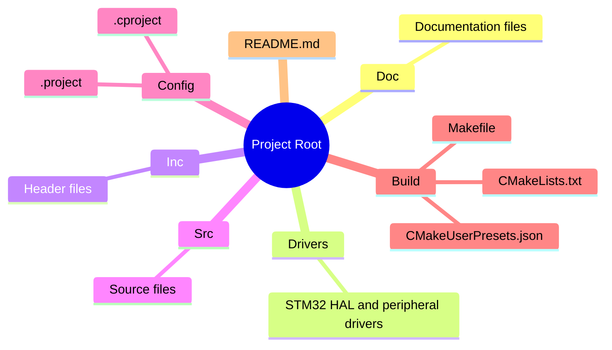

# STM32WB55 Auto-Balance Unicycle Control

This repository contains an STM32 project intended for autonomous balancing unicycle control using the STM32WB55 microcontroller.

## Features
- Real-time balance control loop (50–100 Hz)
- Hollow-shaft BLDC motor torque control (CAN bus)
- Linear motor position control (protocol TBD)
- ~~IMU integration (I²C)~~
- Wireless communication via Bluetooth
- Debugging and telemetry via SWV/SWD

## Documentation

- **[Dual Build System](./Doc/Build.md)** - Build and flash using both STM32CubeIDE and VS Code with CMake.
- **[Software Architecture](./Doc/Architecture.md)** - Overview of the software components and their interactions.
- **[Hardware Setup](./Doc/Hardware.md)** - Instructions for wiring and configuring the hardware.
- **[Communication Protocol](./Doc/Protocol.md)** - Details of the communication protocol used for control and telemetry.

## Getting Started

1. Clone the repository:
```bash
  git clone https://github.com/gaoshenghan1130/Unicycle.git
  cd Unicycle
```
2. Set up the hardware according to the [Hardware Setup](./Doc/Hardware.md) documentation. Check [offical document](https://wiki.st.com/stm32mcu/wiki/Connectivity%3ASTM32WB_BLE_STM32CubeMX) for bluetooth fusion module farmware update, may need flash CPU2 with the latest version.
3. Build and flash the firmware using either STM32CubeIDE or VS Code with CMake as described in the [Dual Build System](./Doc/Build.md) documentation.
4. Connect to the unicycle via Bluetooth for control and monitoring.

## Directory Structure



## License

This project is licensed under the MIT License. See the [LICENSE](./LICENSE) file for details.